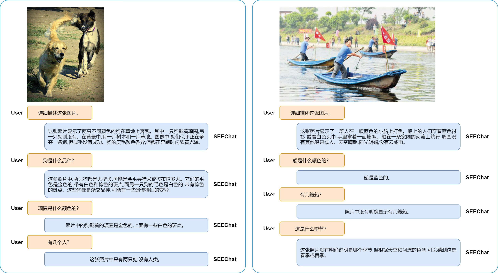
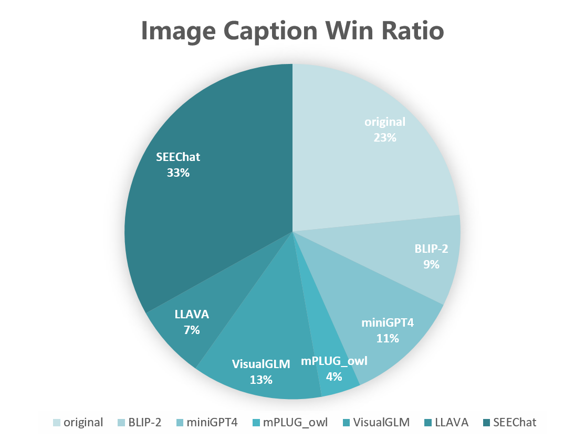

# SEEChat - 一见多模态对话模型
* “一见”取义自“百闻不如一见”，是一个侧重视觉能力的多模态对话大模型，基于单模态专家缝合路线（Single-modal Experts Efficient integration, SEEChat）。
* SEEChat项目的重点是将视觉能力与文本对话能力相集成，长期目标是赋予模型以文本/对话的方式解决视觉任务（图像理解，目标检测，跨模态，开放集）的能力
* “一见”多模态对话模型是SEEChat的开源版本，语言模型部分基于中文[ChatGLM6B](https://github.com/THUDM/ChatGLM-6B)
---
## 能力展示
### 1. VQA-视觉问答

### 2. Image Captioning

* 从中文[Zero](https://zero.so.com)数据集中随机选取1000张中文互联网图像，已排除训练集数据
* 使用[ChineseCLIP](https://github.com/OFA-Sys/Chinese-CLIP)计算图文相关性得分
* 上图为七种公开方法（原生的互联网文本做为其中一种）的图文相关性得分胜出情况
* SEEChat胜出率甚至大比例超过原生文本

---
## 技术方案
SEEChat基于单模态专家缝合路线，通过可学习的桥接层将视觉模态的专家模型与文本模态的专家模型进行缝合，形成具备视觉理解能力的多模态对话模型。

开源V1.0版本的SEEChat，视觉模态基于CLIP-ViT，文本模态基于ChatGLM，可学习的桥接层参考[BLIP-2](https://arxiv.org/abs/2301.12597)以及[LLAVA](https://llava-vl.github.io/)等前期工作，进行如下的两阶段训练：
* Stage I 图文对齐: 使用360人工智能研究院开源的[Zero](https://zero.so.com)数据集，共计2300万图文对桥接层进行训练
* Stage II 人机对齐：使用[LLAVA](https://llava-vl.github.io/)开源的158K instruction数据经翻译后，对桥接层和语言模型部分进行微调
---
## 模型与数据

---
## 性能评测

---
## 相关工作
* [X-LLM](https://x-llm.github.io/): 5月7日公开，由中科院自动化所研发的中文多模态对话模型
* [VisualGLM](https://github.com/THUDM/VisualGLM-6B)：5月18日公开，由清华大学KEG组研发的中文多模态对话模型
